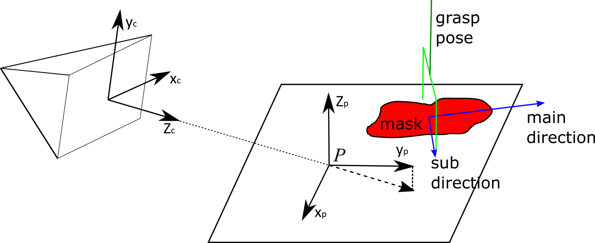
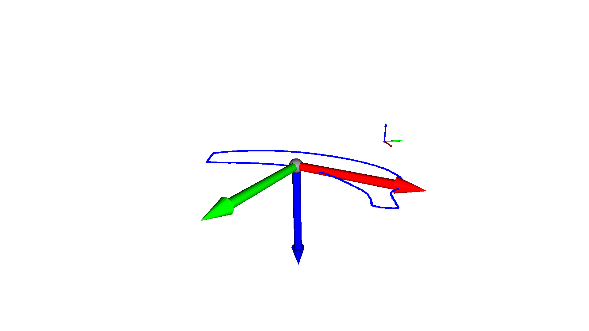
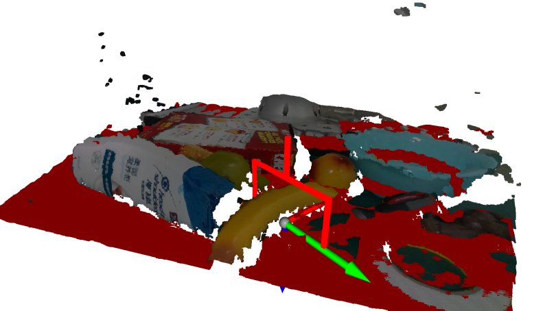

# simple_grasp


### 任务输入
任务的输入是一个约束的平面方程，在相机uv坐标系下的mask以及相机的内参（无需深度图）
### 代码实现
[https://github.com/GouMinghao/simple_grasp](https://github.com/GouMinghao/simple_grasp)
```bash
python3 -m pip install -r requirements.txt
python3 demo.py
```
### 任务假设

1. 夹爪的方向垂直于平面（一般也就是地面或者桌面）
2. 物体的高度不高，可以近似认为是贴着桌面的
### 生成过程
#### 生成平面坐标系
要求Zc和平面（$ax + by + cz + d = 0$）的法向量不能平行，那么以Zc在平面的投影作为y轴，平面法向量作为z轴，可以建立直角坐标系，原点P在camera系中的坐标为

$P = \left(0, 0, -\frac{d}{c}\right)$

法向量（z轴）在camera系中为

$Z_p=(a, b, c)$

其中保证法向量与相机Z轴是正对着的（也就是点乘结果小于0，其实就是c<0）即可，否则取反向，那么可以计算得到xy轴分别为

$X_p=Z_c \times Z_p$
$Y_p = Z_p \times X_p$

因此可以得到camera系到平面系的转换矩阵为$T$

$T=\left| \begin{matrix}
X_p, Y_p, Z_p & P\\
0 & 1\\
\end{matrix} \right|$

假如点在camera系中的齐次坐标为$d_c$，在平面系中的齐次坐标为$d_p$,那么两者的转换关系为
$d_c=Td_p$
$d_p=T^{-1}d_c$

#### 将uv mask投影到平面上
给定平面约束和相机内参，可以根据camera系中的uv计算得到在camera/plane坐标系中的坐标
假设camera系中的uv分别为$u_c, v_c$,相机内参为$f_x, f_y, c_x, c_y$，平面方程为 $ax + by + cz + d = 0$
在camera中的坐标$d_c=\left(d_{cx}, d_{cy}, d_{cz}\right)$为那么根据相机模型有约束

$\frac{u_c - c_x}{f_x} = \frac{d_{cx}}{d_{cz}} \\
\frac{v_c - c_y}{f_y} = \frac{d_{cy}}{d_{cz}}$

根据平面约束有

$a*d_{cx} + b*d_{cy} + c * d_{cz} + d = 0$

可以求解得到

$d_{cz} = -\frac{d}{\frac{a(u_c - c_x)}{f_x} + \frac{b(v_c - c_y)}{f_y} + c}\\
d_{dx} = \frac{u_c - c_x}{f_x} \times d_{cz}\\
d_{dy} = \frac{v_c - c_x}{f_y} \times d_{cz}$

通过上面的camera系到平面系的变换就可以得到某个点在平面系中的坐标
#### 在平面上求取主方向及抓取位姿
先在uv上求解出包围线，然后将他们投影到平面上，在平面上进行2D的PCA计算，可以得到中心点、主方向和次方向，夹爪的夹取方向应该沿着次方向，夹取中心就是PCA的中心，计算结果如下：

### 任务分析和优化方案

1. 假设成立条件

要求相机z轴尽可能垂直于平面，否则物体稍微高一些的时候，会出现拖影问题

2. 解决办法

如果这个假设不成立，则需要使用深度图，用于在平面上找到更加准确的xy坐标用于PCA计算

3. 其他优化

另外抓取位姿的中心可以在PCA的次方向上稍微有所调整，保证更好的抓取结果